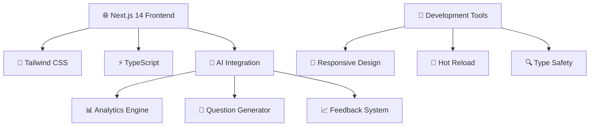

<div align="center">

# ⚡ AI MOCK INTERVIEW ⚡

```ascii
    ╔═══════════════════════════════════════════════════════════════╗
    ║                                                               ║
    ║        🤖 NEXT-GEN INTERVIEW PREPARATION PLATFORM 🤖        ║
    ║                                                               ║
    ║     ▄▀█ █   █▀▄▀█ █▀█ █▀▀ █▄▀   █ █▄░█ ▀█▀ █▀▀ █▀█ █░█ █ █▀▀ █░█░█     ║
    ║     █▀█ █   █░▀░█ █▄█ █▄▄ █░█   █ █░▀█ ░█░ █▄▄ █▀▄ ▀▄▀ █ █▄▄ ▀▄▀▄▀     ║
    ║                                                               ║
    ╚═══════════════════════════════════════════════════════════════╝
```

[](https://nextjs.org/)
[](https://www.typescriptlang.org/)
[](https://openai.com/)
[](https://opensource.org/licenses/MIT)

### 🌟 **THE FUTURE OF INTERVIEW PREPARATION** 🌟

*Where cutting-edge AI meets career success*

---

</div>

## 🎯 **MISSION STATEMENT**

> **"Democratizing interview success through AI-powered preparation"**
> 
> We're building the most advanced mock interview platform that adapts to your unique career journey, providing personalized feedback and realistic interview scenarios that mirror real-world hiring processes.

---

## 🔥 **CORE FEATURES**

<table>
<tr>
<td width="33%" align="center">

### 🧠 **AI BRAIN**
**Neural Interview Engine**
- GPT-4 powered question generation
- Real-time response analysis
- Adaptive difficulty scaling
- Performance pattern recognition

</td>
<td width="33%" align="center">

### 🎭 **ROLE SIMULATION**
**Industry-Specific Scenarios**
- Software Engineering tracks
- Product Management paths
- Data Science interviews
- Leadership assessments

</td>
<td width="33%" align="center">

### 📊 **ANALYTICS HUB**
**Performance Intelligence**
- Detailed scoring metrics
- Improvement recommendations
- Progress tracking dashboards
- Competency heat maps

</td>
</tr>
</table>

---

## ⚙️ **TECH ARCHITECTURE**



---

## 🚀 **LAUNCH SEQUENCE**

### **🔧 Prerequisites**
```bash
# Ensure you have the latest tools
node --version  # v18.0.0+
npm --version   # v9.0.0+
```

### **⚡ Rapid Deployment**

```bash
# 1️⃣ CLONE THE FUTURE
git clone https://github.com/Abhinandhc/ai-mock-interview.git
cd ai-mock-interview

# 2️⃣ INSTALL DEPENDENCIES
npm install
# 🔄 Alternative package managers
# yarn install
# pnpm install  
# bun install

# 3️⃣ IGNITE THE ENGINE
npm run dev
# 🔄 Alternative commands
# yarn dev
# pnpm dev
# bun dev
```

### **🎉 SUCCESS!**
Navigate to [`http://localhost:3000`](http://localhost:3000) and witness the future of interview preparation!

---

## 📁 **PROJECT BLUEPRINT**

```
ai-mock-interview/
├── 🏠 app/                     # Next.js App Router (Main Hub)
│   ├── 🎯 page.tsx            # Landing Experience
│   ├── 🤖 interview/          # Interview Simulator
│   │   ├── [id]/              # Dynamic Interview Sessions
│   │   └── results/           # Performance Analytics
│   ├── 📊 dashboard/          # User Command Center
│   └── 🔧 api/                # Backend API Routes
├── 🎨 components/             # Reusable UI Components
│   ├── 💫 ui/                 # Design System
│   ├── 🤖 interview/          # Interview-specific Components
│   └── 📊 analytics/          # Data Visualization
├── 🛠️ lib/                    # Core Utilities
│   ├── 🤖 ai/                 # AI Integration Layer
│   ├── 📊 analytics/          # Analytics Engine
│   └── 🔧 utils/              # Helper Functions
├── 🌐 public/                 # Static Assets
└── 🎨 styles/                 # Global Styling
```

---

## 💡 **DEVELOPMENT WORKFLOW**

### **🔄 Hot Development Cycle**
1. **Edit** any file in `app/` directory
2. **Save** and watch magic happen (auto-reload enabled)
3. **Test** changes instantly in browser
4. **Iterate** with lightning speed

### **🎯 Key Development Files**
- `app/page.tsx` → **Main landing page**
- `app/interview/page.tsx` → **Interview interface**
- `components/ui/` → **Design system components**
- `lib/ai/` → **AI integration logic**

---

## 🌟 **CUSTOMIZATION GUIDE**

### **🎨 Theming**
```typescript
// tailwind.config.js
module.exports = {
  theme: {
    extend: {
      colors: {
        primary: '#your-brand-color',
        secondary: '#your-accent-color',
      }
    }
  }
}
```

### **🤖 AI Configuration**
```typescript
// lib/ai/config.ts
export const AI_CONFIG = {
  model: 'gpt-4-turbo',
  temperature: 0.7,
  maxTokens: 1000,
}
```

---

## 🎓 **KNOWLEDGE BASE**

<div align="center">

| 📖 **Resource** | 🔗 **Link** | 📝 **Description** |
|:---:|:---:|:---:|
| Next.js Docs | [📚 Learn](https://nextjs.org/docs) | Complete framework guide |
| Next.js Tutorial | [🎓 Interactive](https://nextjs.org/learn) | Hands-on learning |
| GitHub Repository | [💻 Code](https://github.com/vercel/next.js) | Source & community |
| Font Optimization | [🎨 Geist](https://vercel.com/font) | Typography system |

</div>

---

## 🚀 **DEPLOYMENT STRATEGIES**

### **⚡ Vercel (Recommended)**
```bash
# One-click deployment
npm install -g vercel
vercel --prod
```

[](https://vercel.com/new?utm_medium=default-template&filter=next.js&utm_source=create-next-app&utm_campaign=create-next-app-readme)

### **🌐 Alternative Platforms**

| Platform | Command | Features |
|:---:|:---:|:---:|
| **Netlify** | `npm run build` | Static site generation |
| **AWS Amplify** | `amplify publish` | Full-stack deployment |
| **Railway** | `railway deploy` | Database integration |
| **Docker** | `docker build .` | Containerized deployment |

---

## 🤝 **CONTRIBUTION PROTOCOL**

<div align="center">

### **🌟 JOIN THE REVOLUTION**

We're building the future of interview preparation together!

</div>

```bash
# 🍴 Fork the repository
git fork https://github.com/Abhinandhc/ai-mock-interview.git

# 🌿 Create feature branch
git checkout -b feature/revolutionary-feature

# 💾 Commit your innovation
git commit -m "Add revolutionary feature"

# 📤 Push to your fork
git push origin feature/revolutionary-feature

# 🎯 Create Pull Request
# Navigate to GitHub and create your PR
```

### **📋 Contribution Guidelines**
- **🧪 Test** your changes thoroughly
- **📝 Document** new features
- **🎨 Follow** existing code style
- **🔍 Review** before submitting

---

## 📊 **PROJECT METRICS**

<div align="center">


</div>

---

## 🏆 **ACHIEVEMENTS & RECOGNITION**

<div align="center">

🥇 **Built with Next.js 14+**  
🥈 **AI-Powered Innovation**  
🥉 **Open Source Excellence**  

*"The future of interview preparation is here"*

</div>

---

## 📞 **SUPPORT & COMMUNITY**

<div align="center">

[](https://discord.gg/yourdiscord)
[](https://twitter.com/yourtwitter)
[](https://www.linkedin.com/in/abhinandhc05/)

</div>

---

<div align="center">

## 🎉 **READY TO REVOLUTIONIZE YOUR INTERVIEWS?**

### **[🚀 START YOUR AI MOCK INTERVIEW JOURNEY](http://localhost:3000)**

```
     ╔═══════════════════════════════════════════════════════════════╗
     ║                                                               ║
     ║   🌟 BUILT WITH PASSION • POWERED BY AI • SHAPED BY COMMUNITY 🌟   ║
     ║                                                               ║
     ╚═══════════════════════════════════════════════════════════════╝
```

**⚡ Next.js 14+ • 🤖 AI-Powered • 🎯 Interview-Ready • 🚀 Future-Proof ⚡**

---

*Made with 💝 by developers who believe in democratizing success*

---

## 👨‍💻 **CREATOR SPOTLIGHT**

<div align="center">

### **⚡ ABHINANDHC ⚡**
*Full-Stack Developer & AI Enthusiast*

[](https://github.com/Abhinandh05)
[](https://www.linkedin.com/in/abhinandhc05/)
[](https://twitter.com/abhinandhc)
[](https://abhinandhc.dev)

```ascii
    ╔═══════════════════════════════════════════════════════════════╗
    ║                                                               ║
    ║          🌟 PASSIONATE ABOUT CREATING AI SOLUTIONS 🌟          ║
    ║                                                               ║
    ║     "Building the future, one line of code at a time"        ║
    ║                                                               ║
    ║  🚀 Next.js Expert  •  🤖 AI Developer  •  💡 Problem Solver  ║
    ║                                                               ║
    ╚═══════════════════════════════════════════════════════════════╝
```


</div>

---


## 💫 **TECH MASTERY**

<div align="center">

### **🚀 FRONTEND ARSENAL**


### **🤖 AI & BACKEND POWER**


### **⚡ DEVELOPMENT TOOLS**


</div>

---

## 📬 **CONNECT WITH ABHINANDHC**

<div align="center">

### **💬 LET'S BUILD SOMETHING AMAZING TOGETHER!**

```
📧 Email: abhinandhc31@gmail.com
💼 LinkedIn: https://www.linkedin.com/in/abhinandhc05/

```

### **🤝 COLLABORATION OPPORTUNITIES**
- 🚀 **Open Source Projects**
- 🤖 **AI/ML Implementations**
- 💼 **Freelance Development**
- 🎯 **Technical Mentorship**

</div>

---


</div>
